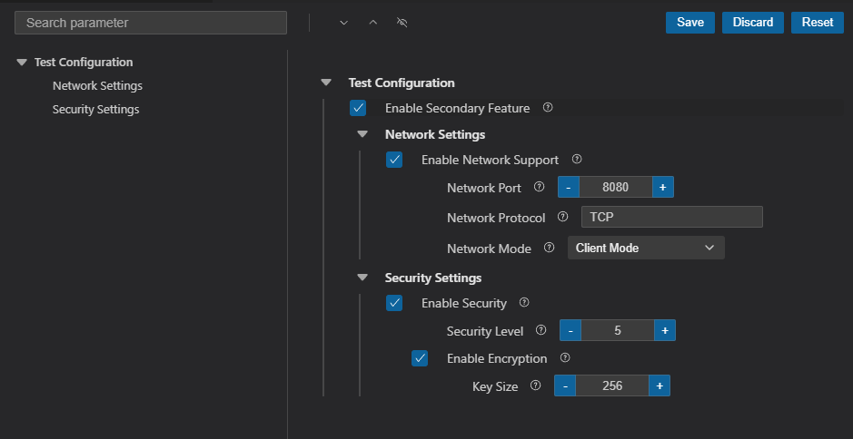
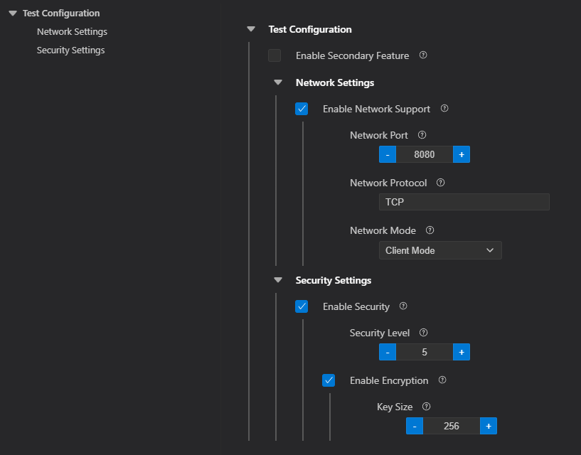
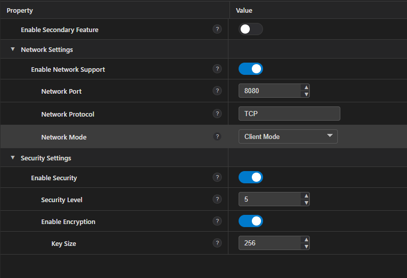

# Kconfig visual Editor for VSCode

**English** | [中文](README_zh.md) 

VSCode Kconfig visual editor with syntax highlighting, auto-completion, validation and menuconfig interface.



Supports 2 rendering UI styles, switchable in settings:

1. Classic menuconfig style



2. Table-style configuration editor



## Features

### Language Support

- Syntax highlighting for Kconfig files
- Intelligent auto-completion for Kconfig keywords
- Real-time syntax validation and error reporting
- Support for multiple Kconfig file formats (Kconfig, Kconfig.*, .config)
- Code snippets for common Kconfig structures

#### Supported Kconfig Syntax

**Configuration Definitions**
- `config` - Define configuration symbol
- `menuconfig` - Define configurable menu item
- `choice` - Define choice group

**Data Types**
- `bool` - Boolean type
- `tristate` - Tristate type (y/m/n)
- `string` - String type
- `int` - Integer type
- `hex` - Hexadecimal type

**Control Flow**
- `if...endif` - Conditional block
- `menu...endmenu` - Menu block
- `choice...endchoice` - Choice block
- `optional` - Optional marker

**Dependencies**
- `depends on` - Dependency condition
- `visible if` - Visibility condition
- `select` - Auto-select other options
- `imply` - Weak dependency (implication)

**Value Settings**
- `default` - Default value
- `def_bool` - Define bool with default
- `def_tristate` - Define tristate with default
- `range` - Numeric range constraint

**File Inclusion & Menus**
- `source` - Include Kconfig file
- `rsource` - Relative path include
- `osource` - Optional include
- `orsource` - Optional relative include
- `mainmenu` - Main menu title
- `comment` - Comment text

**Text & Options**
- `prompt` - Prompt text
- `help` / `---help---` - Help text block
- `option` - Special options (defconfig_list, modules, allnoconfig_y)

**Expressions & Operators**
- Comparison: `=`, `!=`, `<`, `>`, `<=`, `>=`
- Logical: `!`, `&&`, `||`
- Parentheses: `(`, `)`

**Constants & Values**
- Tristate: `y` (yes), `m` (module), `n` (no)
- Numbers: Decimal and hexadecimal (0x prefix)
- Strings: Double-quoted with escape sequences
- Comments: `#` prefix
- Line continuation: `\` suffix

### Visual Configuration Editor

- Interactive menuconfig-style interface
- Search and filter configuration options
- Real-time dependency resolution and validation
- Support for all Kconfig types (bool, tristate, string, int, hex, choice)
- Collapsible menu tree for better navigation
- Save, discard, and reset configuration changes
- Multi-language support (English and Chinese)

## Installation

Install from the VSCode Extension Marketplace or install manually from a .vsix file.

## Supported File Types

### Kconfig Source Files

Files that define configuration options and menu structure:

- **`Kconfig`** - Main Kconfig file (no extension)
- **`Kconfig.*`** - Kconfig variant files with any suffix:
  - `Kconfig.projbuild` - ESP-IDF project build configuration
  - `Kconfig.in` - Linux kernel / Buildroot include files
  - `Kconfig.dev`, `Kconfig.debug` - Custom Kconfig modules
  - And any other `Kconfig.*` pattern files

### Configuration Files

Files that store configuration values:

- **`.config`** - Standard Kconfig configuration output

All file types support:
- ✅ Syntax highlighting
- ✅ Auto-completion
- ✅ Real-time validation
- ✅ Visual editor (for Kconfig source files)

## Requirements

- VSCode 1.60.0 or higher

## Extension Settings

This extension contributes the following settings:

- `kconfig.enableValidation`: Enable/disable syntax validation for Kconfig files (default: `true`)
- `kconfig.autoHeaderPath`: Path to write the generated C header file. Supports absolute paths or paths relative to .config directory (default: `config.h`)

## Usage

### Opening the Visual Editor

1. Right-click on any Kconfig file in the explorer
2. Select "Open Kconfig Visual Editor" from the context menu
3. Or click the configuration icon in the editor title bar when viewing a Kconfig file

### Editing Configuration

- Use the search box to quickly find configuration options
- Click checkboxes, input fields, or dropdown menus to modify values
- Click "Save" to save your changes
- Click "Discard" to discard unsaved changes
- Click "Reset" to reset all configurations to default values

## Build and Installation
1. Clone the repository:
   ```bash
   git clone https://github.com/ai-embedded/vscode-kconfig-visual-editor.git
   cd vscode-kconfig-visual-editor
    ```
2. Install dependencies and compile:
   ```bash
   npm install
   npm run compile
   ```
3. Package the extension:
   ```bash
    npx vsce package
   ```

4. Install the generated `.vsix` file in VSCode:
   ```bash
    code --install-extension vscode-kconfig-visual-editor-<version>.vsix
   ```

## Release Notes

1. 0.1.0 - Initial release with basic Kconfig syntax highlighting and auto-completion
2. 0.2.0:
    - Added table-style Kconfig visual editor
    - Support for RT-Thread environment variable PKGS_DIR
    - Fixed some Kconfig syntax display errors
3. 0.2.1:
    - Fix the error of saving the choice

4. 0.3.0:
   - Optimized loading speed and enhanced the display speed of large-scale engineering loading, supporting RT-Thread large-scale engineering
   - Fixed some compatibility issues with Kconfig syntax

## Testing & Validation

This extension has been thoroughly tested and validated with a wide range of real-world Kconfig files to ensure compatibility and stability. Complete test cases and example files can be found in the [test repository](./test-kconfig/README.md).

## Resources

- **GitHub Repository**: [ai-embedded/vscode-kconfig-visual-editor](https://github.com/ai-embedded/vscode-kconfig-visual-editor)
- **Issue Tracker**: [GitHub Issues](https://github.com/ai-embedded/vscode-kconfig-visual-editor/issues) for bugs and feature requests
- **Examples & Test Suite**: [test-kconfig/README.md](./test-kconfig/README.md)

### Feedback & Contributions

Encountered issues or have suggestions for improvement? We welcome:
- **Report Issues**: Please attach relevant Kconfig files or reproduction steps when submitting issues
- **Contribute Code**: We welcome any form of Pull Requests
- **Improve Testing**: Provide more test cases to help us continuously improve

## License

Licensed under the Apache License, Version 2.0

## Acknowledgments

This extension was developed with reference to the following excellent open source projects:

1. **[Kconfiglib](https://github.com/ulfalizer/Kconfiglib)** - Kconfig syntax compatibility reference
2. **[vscode-esp-idf-extension](https://github.com/espressif/vscode-esp-idf-extension)** - UI design reference
3. **[vscode-kconfig](https://github.com/trond-snekvik/vscode-kconfig)** - Syntax highlighting reference

We are grateful to the authors and contributors of these projects for their outstanding work and contributions to the open source community.
